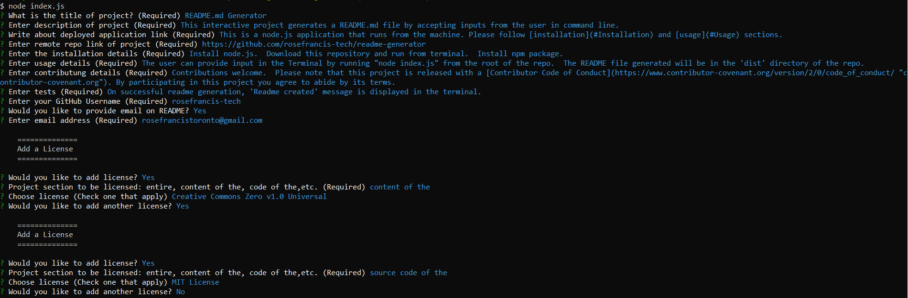

# README.md Generator
   
[](https://choosealicense.com/licenses/mit/) 
    
## Table of Contents
* [Description](#Description)
* [Live project](#Live-project)
* [GitHub Repository](#GitHub-Repository)
* [Installation](#Installation)
* [Usage](#Usage)
* [Contributing](#Contributing)
* [Tests](#Tests)
* [Questions](#Questions)
* [License](#License)
* [Credits](#Credits)

## Description 
This interactive project generates a README.md file by accepting inputs from the user in command line/terminal.

**Built With**
* JavaScript ES5  
* JavaScript ES6  
* Node.js  
* npm

## Live Project
This is a Node.js application that runs from a machine and not a browser. Node.js® is a JavaScript runtime built on Chrome's V8 JavaScript engine. It is neither hosted in the web nor deployed to GitHub pages.  
[View sample README.md](https://github.com/rosefrancis-tech/readme-generator/blob/feature/read-me/dist/README.md) on github generated using this application.  
Please follow [installation](#Installation) and [usage](#Usage) sections for using this application.

## GitHub Repository
The project's repo link: https://github.com/rosefrancis-tech/readme-generator

## Installation
>   Install Node.js from nodejs.org.  
>   Download the [repo](https://github.com/rosefrancis-tech/readme-generator) to your local machine and run it from the Terminal/Command line.  
>   For the first time, install npm by typing 'npm install' in the terminal from the root of the repo.   

## Usage
Please check the [video](https://drive.google.com/file/d/1uvo6Xo1Ou7eRgDIBP5CVv3DO4quAwc6c/view?usp=sharing) for usage instructions.
* Start  
    
    The user can provide input in the Terminal by running "node index.js" from the root of the repo.  

* Enter user data  

    Follow the prompts and enter the answers.  
    Enter text inputs in the format you desire to appear in finished README.md.  
    There is an optional emailid entry.  
    License has to be chosen for each section of your project. If one license covers you entire project, then type 'entire'.  
    
* Add Assets  

    Include screenshots in user inputs as needed. Using the relative filepath, add it to your input:  
    ```md
    
    ```  
    Please make sure that your original project repository (project for which the readme is being made) contains an `assets/images` folder and screenshot file is uploaded to it.  

* Finish  
    
    When all the inputs are given, the application generates a README.md in the folder named 'dist'.  
    Navigate to the 'dist' folder and use it for your project.  
    New README.md files generated will be overwritten on the existing file.  
    Transfer the file to your corresponding project folder before running the app again.  

## Contributing
Contributions welcome.
Please note that this project is released with a [Contributor Code of Conduct](https://www.contributor-covenant.org/version/2/0/code_of_conduct/ "contributor-covenant.org"). By participating in this project you agree to abide by its terms.

## Tests
Errors are thrown on the terminal.  
The command line will show the following messages on success.  

    {ok:true, message: 'Readme created!'}

## Questions
Please visit the github profile.
Github profile : https://github.com/rosefrancis-tech

## License   
The ***entire*** project is licensed under [MIT license](https://choosealicense.com/licenses/mit/).      
        
## Credits  
:trophy:[How to create a Professional README](./readme-guide.md)
:trophy:[Open Source License list](https://opensource.org/licenses/alphabetical)
:trophy:[Choose a license](https://choosealicense.com/)
:trophy:[Emoji](https://github.com/ikatyang/emoji-cheat-sheet/blob/master/README.md)
:trophy:[Badge](https://img.shields.io)
