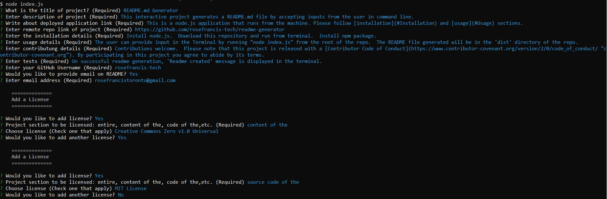

# README.md Generator

    
 
 
    
## Table of Contents
* [Description](#Description)
* [Live project](#Live-project)
* [GitHub Repository](#GitHub-Repository)
* [Installation](#Installation)
* [Usage](#Usage)
* [Contributing](#Contributing)
* [Tests](#Tests)
* [Questions](#Questions)
* [License](#License)
## Description 
This interactive project generates a README.md file by accepting inputs from the user in command line.
## Live Project
This is a node.js application that runs from the machine. Please follow installation and usage sections.
## GitHub Repository
The project's repo link: https://github.com/rosefrancis-tech/readme-generator
## Installation
Install node.js.  Download this repository and run from terminal.  Install npm package.
## Usage
The user can provide input in the Terminal by running "node index.js" from the root of the repo. Please find the screenshot: .  The README file generated will be in the 'dist' directory of the repo.
## Contributing
Contributions welcome.  Please note that this project is released with a [Contributor Code of Conduct](https://www.contributor-covenant.org/version/2/0/code_of_conduct/ "contributor-covenant.org"). By participating in this project you agree to abide by its terms.
## Tests
On successful readme generation, 'Readme created!' message is displayed in the terminal.
## Questions
Please visit the github profile.
Github profile : https://github.com/rosefrancis-tech

Please feel free to write to me at rosefrancistoronto@gmail.com

## License

    
The ***content of this*** project is licensed under [Creative Commons Zero v1.0 Universal](https://creativecommons.org/publicdomain/zero/1.0/legalcode).      
          
The ***source code of this*** project is licensed under [MIT License](https://choosealicense.com/licenses/mit/).      
        
    
